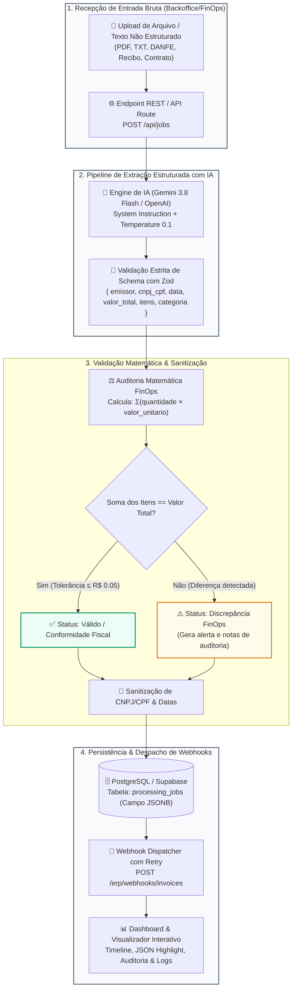

#AI Automation Engine (Pipeline de Extração Estruturada)

> Pipeline corporativo de automação de documentos e auditoria fiscal (Backoffice / FinOps / LegalTech) com extração estruturada de alta precisão via **Gemini 3.8 Flash** & **OpenAI API** (usando **Zod** + **JSON Schema**), sanitização e validação matemática de totais de itens, persistência em PostgreSQL (**Supabase JSONB**) e despacho resiliente de **Webhooks** com retries exponenciais.

---

## 📐 Diagrama de Arquitetura do Pipeline (Mermaid)



---

## 🎯 Propósito & Casos de Uso Corporativos

Resolver dores operacionais críticas em empresas com alto volume documental:
1. **FinOps & Contabilidade**: Eliminação de digitação manual de notas fiscais (NFS-e / DANFE) com detecção automática de erros em faturas de fornecedores antes do pagamento.
2. **LegalTech**: Extração automática de honorários, partes envolvidas, datas e objetos de contratos jurídicos e minutas.
3. **Auditoria de Compras**: Conferência algorítmica se a multiplicação de `quantidade * valor_unitario` realmente totaliza o valor cobrado na nota, evitando pagamentos a maior.

---

## 🛠️ Especificação Técnica (PRD)

- **Framework**: Next.js 15+ (App Router)
- **Linguagem**: TypeScript (Strict Mode)
- **Schema & Tipagem**: Zod (`ExtractedDocumentSchema`)
- **Engine de IA**: Gemini API (`gemini-3.8-flash`) com `responseSchema` estrito via `@google/genai` (suporte a OpenAI API com `response_format: json_object`)
- **Banco de Dados**: PostgreSQL no Supabase com tipo de coluna `jsonb` e índices GIN
- **Webhook Dispatcher**: POST assíncrono com política de até 3 tentativas (backoff exponencial) e log de auditoria
- **Estilização**: Tailwind CSS v4 + Lucide Icons + Motion

---

## 🗄️ Modelagem do Banco no Supabase (`processing_jobs`)

```sql
create table public.processing_jobs (
  id uuid default gen_random_uuid() primary key,
  status text not null check (status in ('pending', 'processing', 'completed', 'failed')),
  document_name text not null default 'documento_fiscal.txt',
  document_type text default 'documento',
  raw_input text not null,
  extracted_data jsonb,
  validation_status text check (validation_status in ('valid', 'discrepancy', 'failed', 'skipped')),
  validation_details jsonb,
  webhook_status text not null check (webhook_status in ('idle', 'pending', 'success', 'failed', 'simulated')),
  webhook_url text,
  webhook_response jsonb,
  error_message text,
  created_at timestamp with time zone default timezone('utc'::text, now()) not null,
  updated_at timestamp with time zone default timezone('utc'::text, now()) not null
);

-- Índice GIN para consultas velozes no JSONB
create index idx_processing_jobs_extracted_data_gin on public.processing_jobs using gin (extracted_data);
```

---

## 🚀 Fluxos Principais Implementados

1. **Entrada Flexível**:
   - Upload de arquivo (drag-and-drop de `.txt`, `.pdf`, `.png`, `.jpg`) ou colagem direta no editor de texto bruto.
   - Botões de **Presets com 1 Clique**: NF-e Cloud (AWS), Honorários Jurídicos, Fatura SaaS em USD e **Documento com Discrepância FinOps Proposital** para demonstração de alertas.

2. **Pipeline de Extração com Schema Rígido**:
   - Força via Zod e JSON Schema da IA os campos obrigatórios:
     - `emissor` (Razão Social / Nome da Entidade)
     - `cnpj_cpf` (Formatado ou identificado)
     - `data_emissao` (Data do documento)
     - `valor_total` (Valor decimal total)
     - `categoria` (Classificação contábil/financeira)
     - `itens` (Lista discriminada de `{ descricao, quantidade, valor_unitario }`)

3. **Validação & Sanitização Matemática**:
   - O backend calcula: `Soma = &Sigma;(item.quantidade * item.valor_unitario)`.
   - Compara a soma calculada com o `valor_total` declarado no documento.
   - Se houver divergência, sinaliza `validation_status: 'discrepancy'` e gera alertas com a quantia exata da diferença.

4. **Webhook Dispatcher com Retry**:
   - Ao concluir a validação, despacha automaticamente um payload padronizado via HTTP POST para o endpoint do ERP / Slack / Discord com até 3 tentativas.
   - O usuário pode testar URLs reais ou o simulador integrado que responde com status HTTP 200 e ID de transação ERP simulado.
   - Possibilidade de re-disparar o webhook manualmente a qualquer momento.

5. **Página de Visualização & Inspeção**:
   - Dashboard com KPIs (Total de Jobs, Concluídos, Discrepâncias, Webhooks entregues).
   - Gaveta de inspeção em profundidade com abas:
     - **Resumo & Auditoria**: Cards executivos e alerta matemático.
     - **Tabela de Itens**: Listagem tabulada de produtos e valores.
     - **JSONB Formatado**: Código JSON formatado com botão de cópia rápida.
     - **Logs de Webhook**: Status code, latência, payload enviado e resposta.
     - **Texto Original**: Consulta ao documento original processado.

---

## 💻 Como Rodar o Projeto Localmente

### 1. Clonar o repositório
```bash
git clone https://github.com/SEU_USUARIO/ai-automation-engine.git
cd ai-automation-engine
```

### 2. Instalar as dependências
```bash
npm install
# ou
pnpm install
# ou
yarn install
```

### 3. Configurar as variáveis de ambiente
Crie um arquivo `.env.local` baseado no template `.env.example`:
```bash
cp .env.example .env.local
```
Preencha suas chaves no `.env.local`:
```env
# Provedores de IA (adicione ao menos um)
GEMINI_API_KEY="sua_chave_gemini"
OPENAI_API_KEY="sua_chave_openai"

# Supabase (Opcional - caso queira persistência em nuvem; caso contrário roda em memória)
NEXT_PUBLIC_SUPABASE_URL="https://seu-projeto.supabase.co"
NEXT_PUBLIC_SUPABASE_ANON_KEY="sua_anon_key"

# URL da Aplicação
APP_URL="http://localhost:3000"
```

### 4. Configurar o banco de dados (Supabase)
Execute o script contido em `supabase/schema.sql` no SQL Editor do seu projeto Supabase para criar a tabela `processing_jobs` e os índices GIN.

### 5. Iniciar o servidor de desenvolvimento
```bash
npm run dev
```
Abra [http://localhost:3000](http://localhost:3000) no navegador para acessar o dashboard.

---

## 📦 Build & Produção

```bash
# Compilação para produção
npm run build

# Inicialização em modo produção
npm run start
```

---

## 📄 Licença

Distribuído sob a licença MIT. Sinta-se livre para usar em seu portfólio, adaptar e estender.

